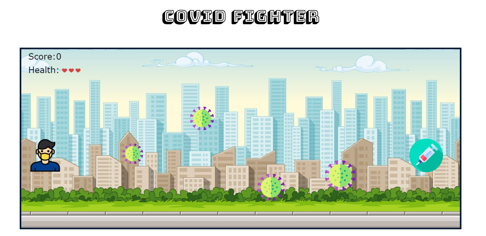

# Covid-Fighter-Game
##  Introduction
This a simple game where the player has to reach the vaccination center by overcoming the obstacles.  
## About the game
- The Player can move left and right by the LeftArrow and RightArrow keys respectively.
- The Player's score will depend on how much distance he has moved.
- On collion with the covid virus the health and score of the Player decreases.
- If the health becomes zero it's Game Over. 
- If the Player passes through all the obstacles the Player Wins .
## Screenshot
 
 
## Try it out
https://rounakneogy.github.io/Covid-Fighter-Game/
## Tech Stack

 

